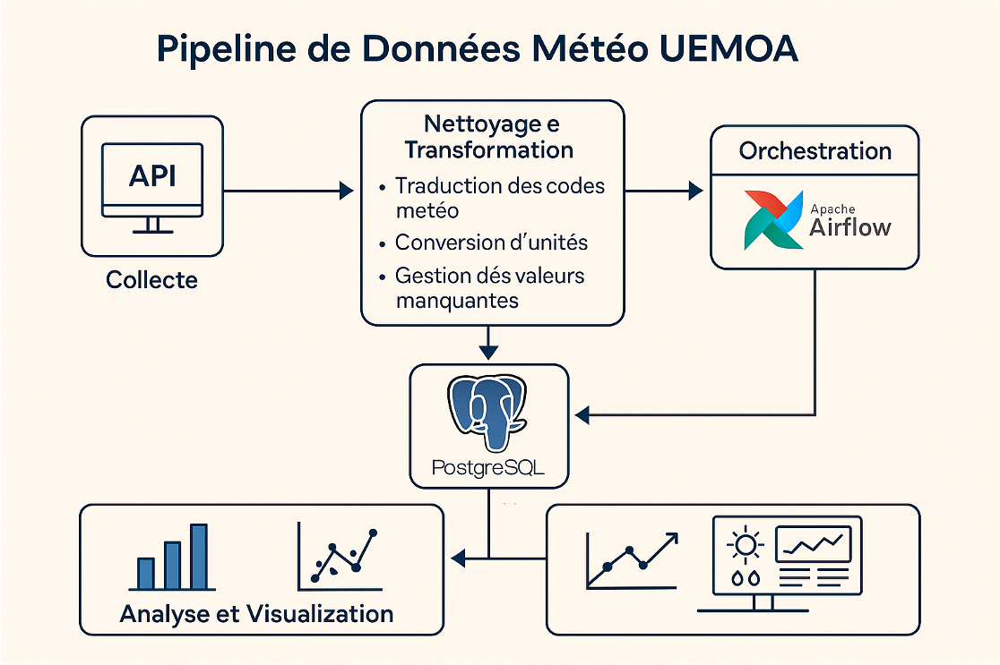

# Meteo UEMOA — Pipeline de Données Météorologiques

Pipeline ETL complet pour collecter, traiter, analyser et visualiser
les données météorologiques historiques de **80 villes** de la zone UEMOA
(10 villes par pays membre).

---

## Architecture du pipeline



---

## Objectif

Ce projet vise à construire une solution de données de bout en bout pour
le suivi et l'analyse des tendances climatiques en Afrique de l'Ouest.
Les données collectées ont des applications concrètes dans des domaines
tels que l'agriculture, la gestion des risques et la planification urbaine.

L'approche intègre :
- L'automatisation de la collecte via API
- Le nettoyage et l'enrichissement des données
- Le stockage dans une base PostgreSQL optimisée avec un schéma en étoile
- L'exploitation via des dashboards interactifs et des analyses exploratoires

---

## Etapes détaillées du projet

### Etape 1 — Collecte des données (`openmeteo_uemoa.py`)

Récupération automatique des données météorologiques historiques via
l'**API Open-Meteo** pour 80 villes réparties dans les 8 pays de l'UEMOA.

**Ce que fait ce script :**
- Interroge l'API Open-Meteo pour chaque ville de la liste UEMOA
- Récupère les variables météo : température, précipitations, humidité, vent
- Stocke les données brutes pour la phase de transformation

---

### Etape 2 — Nettoyage et Transformation (`transform_uemoa.py`)

Traitement et enrichissement des données brutes collectées.

**Ce que fait ce script :**
- Traduction des codes météo en descriptions lisibles (ex: code 61 → "Pluie modérée")
- Conversion des unités de mesure (températures, vitesses de vent, etc.)
- Gestion des valeurs manquantes par interpolation ou remplacement
- Standardisation des formats de dates et de colonnes

---

### Etape 3 — Chargement dans PostgreSQL (`load_uemoa.py`)

Stockage des données transformées dans une base **PostgreSQL 14+**
avec un schéma en étoile optimisé pour les requêtes analytiques.

**Ce que fait ce script :**
- Crée le schéma en étoile : table de faits météo + tables de dimensions
  (villes, pays, dates, indicateurs)
- Charge les données via SQLAlchemy et Psycopg2
- Garantit l'intégrité des données et évite les doublons

**Schéma en étoile :**
```
        dim_ville
            |
dim_date — fait_meteo — dim_indicateur
            |
          dim_pays
```

---

### Etape 4 — Orchestration avec Airflow (`pipeline_meteo_uemoa.py`)

Automatisation complète du pipeline avec **Apache Airflow**.

**Ce que fait ce script :**
- Définit un DAG (Directed Acyclic Graph) qui enchaîne les 3 étapes :
  collecte → transformation → chargement
- Planifie l'exécution automatique du pipeline
- Permet le monitoring et la relance en cas d'erreur

---

### Etape 5 — Analyse Exploratoire (`analyse_meteo.py`)

Analyse statistique et exploratoire des données stockées.

**Ce que fait ce script :**
- Charge les données depuis PostgreSQL
- Analyse les distributions de températures, précipitations et humidité
- Compare les tendances climatiques entre pays et régions
- Génère des visualisations avec Matplotlib et Seaborn
- Produit des statistiques descriptives par ville, pays et saison

---

### Etape 6 — Dashboard interactif (`app_dash.py`)

Visualisation dynamique des données avec **Dash** et **Plotly**.

**Ce que fait ce script :**
- Lance une application web interactive
- Affiche les données météo par ville, pays et période
- Propose des graphiques interactifs : courbes de températures,
  histogrammes de précipitations, cartes de chaleur
- Permet le filtrage dynamique par date et par région

---

## Technologies utilisées

| Catégorie | Outils |
|-----------|--------|
| Langage principal | Python 3.11 |
| API & Web | FastAPI, Requests, Open-Meteo API |
| Base de données | PostgreSQL 14+, SQLAlchemy, Psycopg2, pgAdmin 4 |
| Traitement des données | Pandas, NumPy, PyArrow |
| Orchestration | Apache Airflow |
| Visualisation | Plotly, Dash, Matplotlib, Seaborn |
| Environnement | VS Code, Jupyter Notebook, macOS Terminal |
| Gestion des paquets | pip, Conda, Homebrew |

---

## Structure du projet

```
meteo-uemoa-api/
├── scripts/
│   ├── openmeteo_uemoa.py       # Etape 1 : Collecte via API
│   ├── transform_uemoa.py       # Etape 2 : Nettoyage et transformation
│   ├── load_uemoa.py            # Etape 3 : Chargement PostgreSQL
│   ├── pipeline_meteo_uemoa.py  # Etape 4 : Orchestration Airflow
│   ├── analyse_meteo.py         # Etape 5 : Analyse EDA
│   └── app_dash.py              # Etape 6 : Dashboard interactif
├── app/
├── application/
├── pipeline.png
├── requirements.txt
└── README.md
```

---

## Lancer le projet

```bash
# Cloner le dépôt
git clone https://github.com/Nokho11/meteo-uemoa-api.git
cd meteo-uemoa-api

# Installer les dépendances
pip install -r requirements.txt

# Etape 1 : Collecter les données
python scripts/openmeteo_uemoa.py

# Etape 2 : Transformer les données
python scripts/transform_uemoa.py

# Etape 3 : Charger dans PostgreSQL
python scripts/load_uemoa.py

# Etape 4 : Lancer Airflow pour automatiser
airflow dags trigger pipeline_meteo_uemoa

# Etape 5 : Analyse exploratoire
python scripts/analyse_meteo.py

# Etape 6 : Lancer le dashboard
python scripts/app_dash.py
```

---

## Résultats obtenus

- Pipeline ETL robuste couvrant 80 villes sur 8 pays de la zone UEMOA
- Orchestration automatisée et planifiée avec Apache Airflow
- Base de données PostgreSQL structurée en schéma en étoile
- Analyse exploratoire complète des tendances climatiques régionales
- Dashboard interactif pour la visualisation et le suivi des données en temps réel

---

## Auteure

**Ndeye Sokhna Nokho**

[Portfolio](https://portfolio-nsn.netlify.app) · [LinkedIn](https://www.linkedin.com/in/ndeye-sokhna-n-02327b373) · [GitHub](https://github.com/Nokho11)

---

*Projet réalisé dans le cadre de la certification Data Engineering — FORCE-N / Université Numérique Cheikh Hamidou Kane*
